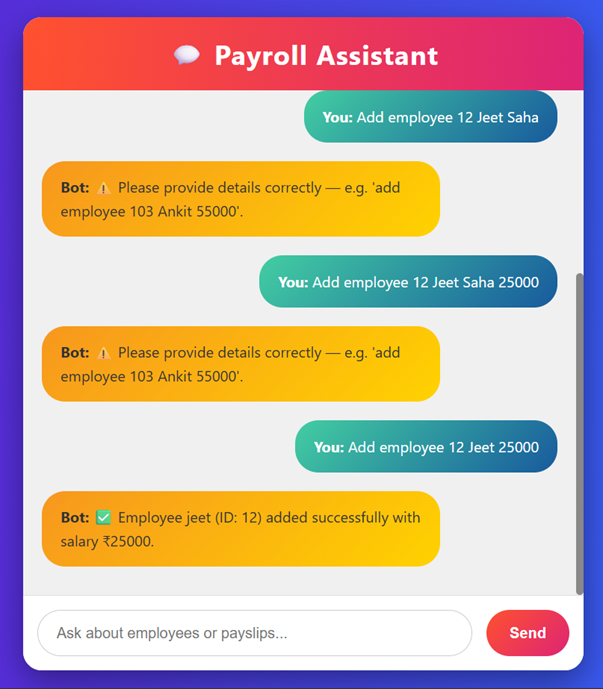

# 💬 AI Payroll Assistant with Chatbot


---

## 🧠 Abstract
The **AI Payroll Assistant with Chatbot** is an intelligent, automated system that merges **payroll management** with **conversational AI** to simplify employee salary processing and HR communication.  
Unlike traditional payroll systems that depend on manual data entry, this project uses **Artificial Intelligence (AI)** to automate payroll calculations, handle employee queries, and offer real-time assistance through an interactive chatbot.

By integrating **Natural Language Processing (NLP)** and **Machine Learning**, it transforms payroll into a **smart, interactive, and self-service experience** — ensuring accuracy, transparency, and convenience for both employees and HR administrators.

---

## 📘 1. Introduction
Payroll management is a crucial but repetitive HR function involving salary calculation, deductions, tax management, and payslip generation. Traditional systems often lack real-time communication and automation.

The **AI Payroll Assistant** addresses these limitations through:
- Automated salary computation.  
- Real-time conversational support.  
- Instant payslip generation.

Employees can simply ask questions like:
> “What is my current month’s salary?”  
> “Show my tax deductions.”  
> “When will my next payment be processed?”

The chatbot intelligently interprets and responds using the payroll database — enabling **faster, more transparent, and efficient** payroll management.

---

## 🎯 2. Objectives
The primary objectives of this project are:
- 🤖 Automate payroll processing, including salary, deductions, and taxes.  
- 💬 Integrate a chatbot for instant payroll-related communication.  
- 👨‍💼 Reduce HR workload by automating repetitive queries.  
- 🔐 Ensure accuracy, transparency, and data security.  
- 🚀 Enhance employee satisfaction through conversational access to payroll data.  

---

## ⚙️ 3. System Overview
The system combines two major components — a **Payroll Processing Engine** and an **AI Chatbot Interface** — powered by a **centralized database**.

### 🧩 Major Modules:
1. **Employee Management Module**
   - Stores employee details: ID, name, department, role, and salary.
   - Allows admin CRUD (Create, Read, Update, Delete) operations.

2. **Attendance & Leave Tracking**
   - Integrates attendance data for precise salary calculation.
   - Adjusts for leaves, bonuses, and overtime.

3. **Payroll Processing Module**
   - Calculates gross, deductions, and net salary automatically.
   - Generates and stores monthly payslips.

4. **AI Chatbot Module**
   - Uses NLP to understand natural language queries.
   - Responds conversationally to payroll-related questions.
   - Provides both free-text and menu-based interactions.

5. **Admin Dashboard**
   - Displays payroll trends, analytics, and expenditure reports.
   - Enables admin control and payroll monitoring.

---

## 🌟 4. Features
- 💬 **AI Chatbot Support:** Employees interact naturally with payroll data.  
- ⚙️ **Automated Salary Calculation:** Handles taxes, bonuses, and deductions.  
- 📄 **Payslip Generation:** Creates downloadable PDF payslips instantly.  
- 🔒 **Secure Access:** Encrypted authentication for users and admins.  
- 📊 **Analytics Panel:** Admin dashboard with payroll statistics.  
- 🧠 **Natural Language Understanding:** Smart text interpretation using NLP.  
- ⏱️ **Time Efficiency:** Saves hours of manual HR effort.  

---

## 🖥️ Payroll Assistant Interface


---

## 💫 5. Speciality of the System
The **AI Payroll Assistant** stands out because it integrates **automation and communication** into one intelligent platform.

### 🧩 Key Specialities:
- 🤝 **Conversational Payroll:** Employees can chat to get salary or leave details.  
- 🗣️ **Human-Like Responses:** Uses AI for natural, context-aware conversations.  
- 🧮 **Automation + Communication:** Combines payroll computation with chatbot interaction.  
- 🔁 **Self-Service Model:** Reduces HR dependency.  
- ☁️ **Scalability:** Easily adaptable for cloud-based or enterprise HR systems.  

This project represents the next generation of **HR tech**, where payroll becomes not just automated — but **interactive**.

---

## 🧰 6. Technologies Used
| Component | Technology |
|------------|-------------|
| **Frontend** | HTML, CSS, JavaScript |
| **Backend** | Python (Flask or Django) |
| **Database** | MySQL / SQLite |
| **AI Components** | Natural Language Toolkit (NLTK), Rule-based NLP or ML intent recognition |
| **Tools** | Visual Studio Code, XAMPP (optional for local database) |

---

## 🏗️ 7. System Architecture
The architecture follows a **client-server model** with modular design.

### Layers:
1. **Client Interface:** Web UI for employees/admins (chat, dashboard).  
2. **Server Logic:** Handles chatbot interactions and salary computations.  
3. **AI Chat Engine:** Processes text, identifies intent, and returns answers.  
4. **Database Layer:** Stores employee, payroll, and attendance data securely.  

This ensures scalability, maintainability, and future integration with enterprise systems.

---

## 🚀 8. Advantages
- ⏰ Saves HR time by automating repetitive tasks.  
- 💬 Provides 24×7 instant support to employees.  
- ✅ Reduces human errors in payroll computation.  
- 🔍 Improves transparency and trust.  
- 💰 Cost-effective and scalable for organizations of all sizes.  

---

## 🔮 9. Future Scope
- 🎙️ Voice-enabled payroll assistant using speech recognition.  
- 🕵️ AI-based anomaly detection for payroll fraud prevention.  
- ☁️ Cloud integration for remote HR access.  
- 🌍 Multilingual chatbot for regional language support.  
- 🔗 Integration with biometric attendance systems.  

---

## 🏁 10. Conclusion
The **AI Payroll Assistant with Chatbot** redefines payroll management by fusing **automation**, **intelligence**, and **human-like interaction**.  
It minimizes manual intervention, improves accuracy, and enhances employee engagement — representing a major leap toward **smart HR systems** of the future.

> 💡 *“Efficiency meets intelligence — where payroll talks back!”*

---


## ⚙️ How to Run
1. Clone the repository  
   ```bash
   git clone https://github.com/yourusername/ai-payroll-assistant.git
   cd ai-payroll-assistant
